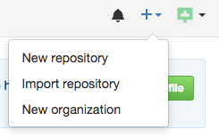
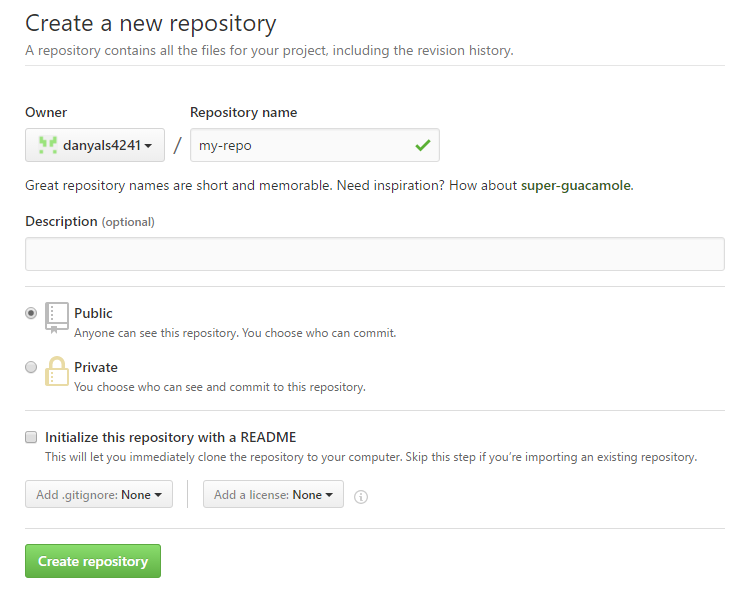
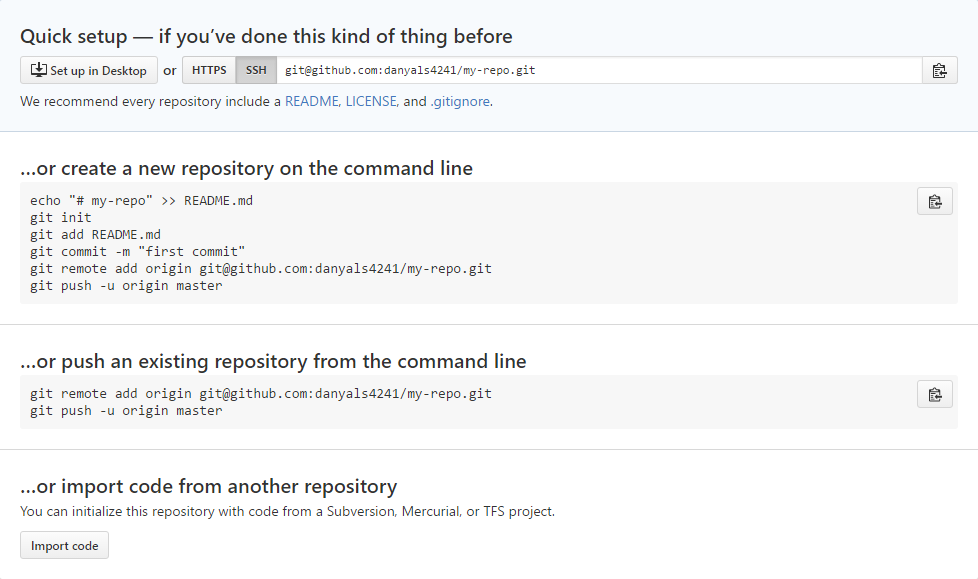

# GitHub Tutorial

by **Danyal Sarfraz**  
```
Notes :
 **All important terms will be bolded
 **Do not include <'s and >'s in your code, those are meant to display custom inputs
```
---
## Git vs. GitHub

##### What is Git?
Git is a software that runs in the command line which lets you **save and control your files**. In more technological terms you can call it a **DVCS** (_**Distributed Version Control System**_).

##### What is GitHub?
GitHub utilizes Git to **push ones changes to the cloud** to make sure they are **somewhere safe and accessible anywhere in the world**. This allows for **filesharing** across the globe. Making doing your projects easier if you are on the move constantly. You can call it a **"hub"** for **"git"**. It's a **server for multimedia sharing**.

##### So what is the difference?
Git is the software that **provides bases and mechanisms to share content and save it**, however GitHub is what utilizes that software to make it work. An easy way to know the difference is that GitHub is a "hub" for "git" to work on. Basically meaning GitHub is a server.

---
## Initial Setup
##### How do I start working on Git?
Before we create an account on [GitHub](github.com) we need to first setup our **IDE** or Integrated Development Environment.
- **Make sure your IDE is acceptable to be used and provides a SSH key. This will be helpful further on in the tutorial. A good IDE to use would be Cloud9. For further information visit their [website](c9.io). Here is a helpful [link](https://docs.c9.io/docs/setting-up-github-workspace) if you are interested.**

Once you have made sure you have an IDE that is compatible with GitHub proceed with these following steps:
* Go to [GitHub](github.com).
* Click the Sign Up button.
* Enter all required information in Step 1. 
* Once you are at Step 2 make sure you choose the free plan. You can choose the paid plan but for now for the sake of this tutorial we will keep with the free one.
* In Step 3 it is up to you to do the survey, you can skip it if you want.
* Now verify your email and we can continue with your IDE.
* **Make sure you research how to use GitHub. There are many resources online!**

Now it's time to link our GitHub to our IDE.
* Retrieve your SSH key, normally you would find it in a SSH keys tab. Google if you are having problems finding it!
* Copy the key and go to GitHub. **github > top-right > profile icon > settings
left sidebar > SSH keys**
* Paste it and add SSH key, before you add it make sure it starts with ssh-rsa. _Make sure you copy it correctly_.
* Return to your IDE, paste `ssh -T git@github.com` and press enter. You will be greeted by something like this 
```
Hi <your username>! You've successfully authenticated, but GitHub does not provide shell access._
```
* Now you're _done!_


---
## Repository Setup

##### Now what do I do on GitHub?

Great question! You will now learn to do basic things in your IDE using Git!

##### Making our first repository.


**_Git_ your IDE ready for the following commands**: (Haha, anyone get the pun? Sorry I'm not funny.)
* `cd ~/workspace` (Correct syntax: `cd <your address>`. This will take you into the **directory** `workspace` that is inside the **root**, which here is represented by a `~`. **NEVER** do work in the root folder unless you are a professional and know what you are getting into.)
* `mkdir my-repo` (Correct syntax: `mkdir <name>`. This will create a directory, in less technical words a folder. Imagine a folder, it is literally what it sounds like. In this folder we will put files or to go with our analogy we will insert papers and documents. But it always doesn't have to be files, we can also put folders into folders, _folderception_.)
* `cd my-repo` (Correct syntax: `cd <name of folder>`. This will enter you into your directory **my-repo** and will allow you to now make files and folders inside of it.)
* `git init` (Correct syntax: `git init`. This will **initialize** the directory you are currently in as a repository, specifically a **local repository**. Meaning this will live on your computer and then you are able to push it to a **remote repository** to save and for others to then freely use on GitHub.)
    * Before we continue we need to make sure our folder "my-repo" was created in the correct place. In your command line make sure it looks like this `<your username here>: ~/workspace/my-repo (master)`.
    * If your location address does not look similar you have made an error. In order to fix this follow these troubleshooting steps.
        1. _**ERROR HANDLING**_ : If your address is `~/my-repo` then you should simply type `cd ~` to go into the root. Then proceed by typing `rm -rf my-repo`. `rm -rf foldername`, this command will remove any folder hence "rm". The "-rf" means that anything inside the folder and the folder itself will be removed altogether. If you just use rm it will not proceed with the command due to things inside.
    * If you don't see (master) at the end of the address then you didn't correctly initialize. Read the following scenario. 
        2. _**ERROR HANDLING**_ : Let's say for example you forgot to cd into my-repo and now you accidentally initialized a repository in workspace, **how do I fix this?** Simply stay in the area you initialized and type `ls -a`. This command will help us see hidden files, mainly system files. You should see something called `.git`. We will manually remove it, do **NOT** delete workspace. Type `rm -rf .git` to get rid of the .git folder. This will uninitialize your workspace. Now remember to **always cd into the directory you made so you can make changes**.
            
##### Adding files to our repository

* `touch my-file.txt` (Correct syntax: `touch <name.ext>`. This will create a text file called "my-file". In the syntax you always required to add the **file extension** type for example .css, .html, .txt, .md etc. This will determine what type of file it is going to produce. A correct use of the command would be `touch website-Layout.css`.)
* Open my-file.txt and type anything you want!
* Now make sure your file is **saved**.
* `git add my-file.txt` (Correct syntax: `git add <filename.ext>`. This will add the file to our **staging area**. The staging area is the place where we add the files we made changes to so we can later save it.)
* This is a tip, but not required. Periodically type `git status` after adding to see if anything is ready to be commited and to see if any file was changed after the last commit. This means that if git notices a file that is completely new or changed from its previous iteration it will prompt you to commit it. This make the file name appear red, if it appears green the file is recognized and has had no changes to what has been commited previously.
* `git commit -m "made a file"` (Correct syntax: `git commit -m "yourmessagehere"`. This will then take whatever is in the staging area or in other words the changes to a file and then applies them to our remote respository on GitHub. If you commit a entirely new file that has never been commited before it will just make a copy of it on the remote. If it's old it will simply overwrite and apply your changes onto the previous file with the same name.)
* Now it's time to create a remote repository where we can store our files and push from our IDE!
* Go to [GitHub](github.com).
* Find this "+" sign.  
  
* Click it  
  
* Click New Repository.
* You will see something like this.     
     
* Copy what the image shows. 
* The name of your remote **has** to match your local!
* Create your repository!   

* You will be taken to screen like this.  

* Click **SSH** on top and then look at where it says **"...or push an existing repository from the command line"** . Copy and paste each line of code in that box **seperately** into your command line and enter each one **seperately**.
* After that is done go back to your GitHub and open the repository you made and _voila!_ Your changes are now on the website!
* _**Success!**_   Now practice adding, commiting and pushing!
            

---
## Workflow & Commands

Workflow is key for coders. If you don't have a smooth workflow you will for sure encounter confusion. Make it easy on yourself.

In our workflow we should be repeating status, add, status, commit, push. We do this because we want to make sure our workflow is well thought out and is organized so we encounter the minimum amount of confusion of what is appropiate to do next.

This workflow consists of 6 steps that are easy to learn:
1. `git init`  
2. (edit your files)  
3. `git status`  
4. `git add file.ext`  
5. `git status`  
6. `git commit -m "message"`  
7. `git push`  

**Repeat numbers 2 to 7** 

We first do `git init` to initialize the area of our work flow. Then we proceed to add files to edit. Then we add things to our file, for example code for a video game or just basic instructions on how to play it. After we do our edits we should then type `git status` to check on our files and make sure that our changes are noticed by git. Once we have made sufficient enough edits we will then proceed to add it to our staging area by using `git add .`. Adding all the files we made changes to. Now we use `git status` once again as it is a part of our efficient work cycle. Once we see green text showing all the files we have added we can then safely go ahead and commit our changes. By using `git commit -m "message"` we are ensuring that our git is compiling all our changes and is ready to send them up to the cloud onto GitHub. Once we have commited we can now use `git push` to then send these off to our remote repository. This type of workflow is very efficient and useful because we will always know what do after every important change we make to our files. This won't leave one in confusion, _"Wait, what do I do now?"_.

 


